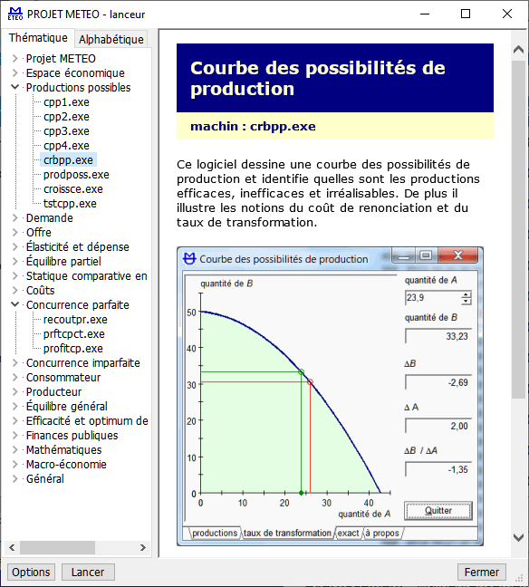
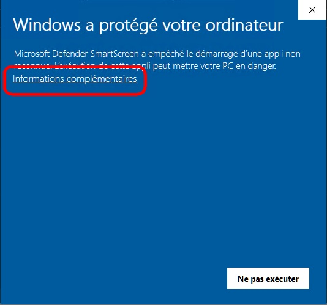
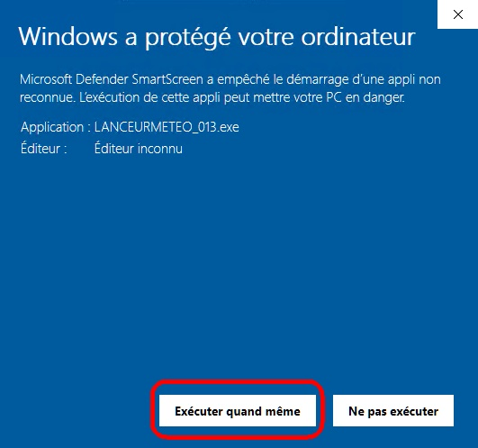
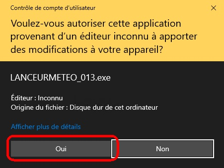
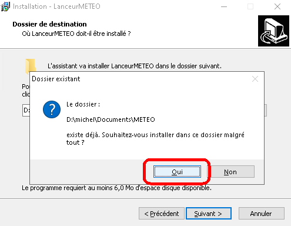

# meteo

**m**achins pour **e**nseigner la **t**héorie **é**conomique avec **o**rdinateur

----

Ce projet informatique contient 135 machins (applications Windows) qui facilitent la présentation et la compréhension des concepts élémentaires de la théorie économique. 

Depuis son hébergement sur GitHub, il n'est plus possible de télécharger un machin individuel. En revanche, tous les machins sont contenus dans une archive qu'on peut obtenir en cliquant sur le lien: [meteo.zip](bin/meteo.zip).

> Le contenu de l'archive n'a qu'à être extrait dans un dossier appartenant à l'utilisateur. Chaque machin peut alors être démarré avec un double-clic de la façon habituelle.

> Si **LanceurMETEO** doit être installé, il est préférable d'extraire le contenu de l'archive vers le dossier `..\Documents\METEO`.

Les noms des applications sont cryptiques. L'archive [docs.zip](bin/docs.zip) contient des descriptions des machins. 

> Le contenu de l'archive n'a qu'à être extrait dans un dossier appartenant à l'utilisateur. Commencez avec le fichier `index.html` qui contient les liens vers les quatre listes de descriptions.

> Il n'est pas utile de télécharger `docz.zip` si l'on installe **LanceurMETEO**.

**LanceurMETEO** affiche la description de chacun des machins constituant le projet METEO par thème ou de façon alphabétique. 

On peut voir sur la capture d'écran que le machin `crbpp.exe` est sélectionné dans le thème `Productions possibles`. Un clic sur le bouton `Lancer` démarrera le machin. Un double-clic sur le nom du machin en fait autant.

Installers **LanceurMETEO** se fait en xx étapes.

1. Télécharger l'archive [meteo.zip](bin/meteo.zip).

1. Créez le sous-dossier `METEO` dans le dossier `Documentes` de l'utilisateur.

1. Extraire le contenu de l'archive dans le dossier `..\Documents\METEO`.

1. Obtenir le programme d'installation [INSTALL_LANCEURMETEO_013.exe](bin/INSTALL_LANCEURMETEO_013.exe)

1. Lancer le programme d'installation avec un double-clic sur son nom.

   

1. Si Defender décide de protéger votre ordinateur, cliquez sur `informations complémentaires`.

   

1. Continuez en cliquant sur `Exécuter quand même`.

   

1. Autorisez l'application.

1. Acceptez les paramètres d'installation proposés par le programme. 

   

1. Confirmez l'installation dans le dossier METEO malgré qu'il existe déjà.
